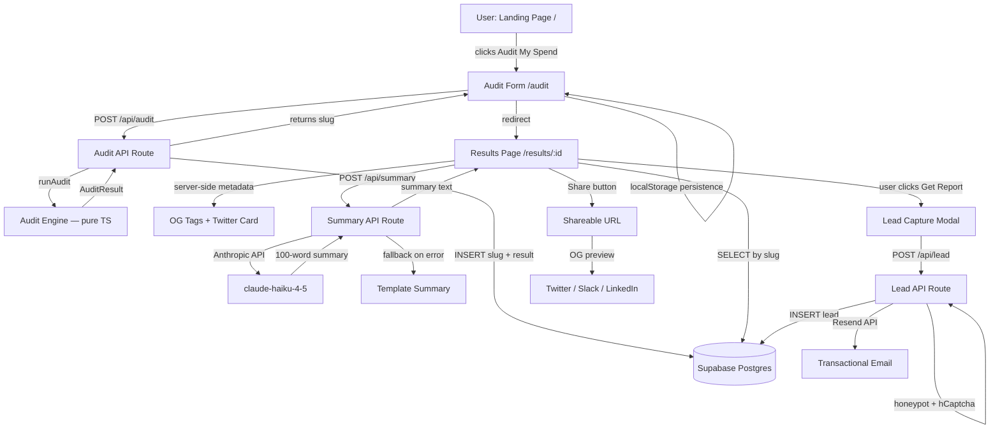

# ARCHITECTURE.md — StackLens

## Overview

StackLens is a Next.js 16 (App Router) web application with a Supabase Postgres backend, Anthropic API integration for AI summaries, and Resend for transactional email. The audit engine is a pure TypeScript module with no external dependencies.

---

## System Diagram



---

## Data Flow: Input → Audit Result

```
1. User fills form (/audit)
   └─ Team size, use case, tools (toolId, planId, seats, monthlySpend)
   └─ Persisted to localStorage on every change

2. Form submits → POST /api/audit
   └─ Zod validates input schema
   └─ IP rate-limited (15 req/hr in-memory)

3. runAudit(input) — pure function, zero I/O
   └─ For each tool entry:
      a. Identify plan from TOOLS registry
      b. Check: is actual spend > list price? (billing error flag)
      c. Check: excess seats vs team size?
      d. Check: min seat requirement violated? (e.g., Team plan with 1 user)
      e. Check: use-case mismatch? (coding IDE for writing team)
      f. Check: cheaper same-vendor plan fits?
      g. Check: cheaper alternative tool fits? (≥25% cheaper per seat)
      h. Default: optimal — return "stay"
   └─ Sum savings across all tools
   └─ Flag isHighValueCase if totalMonthlySavings > $500
   └─ Return AuditResult

4. API saves to Supabase
   └─ audits table: slug (nanoid), form_data (sanitised), result (JSONB)
   └─ slug returned to client

5. Client redirects to /results/:slug

6. Results page (server component)
   └─ Fetches audit by slug from Supabase
   └─ Generates OG metadata from result data
   └─ Renders ResultsClient component

7. Client fetches /api/summary async
   └─ Calls Anthropic claude-haiku-4-5 with structured prompt
   └─ Falls back to template on error/timeout

8. User submits lead → POST /api/lead
   └─ Honeypot field check
   └─ hCaptcha token verification (if enabled)
   └─ INSERT to leads table
   └─ Send confirmation email via Resend
```

---

## Stack Justification

### Next.js 16 (App Router)
**Why:** The shareable URL requirement needs server-side OG tag rendering — `generateMetadata` in App Router does this natively per page without an additional SSR layer. We get React Server Components, API routes, and deployment to Vercel in one framework.

**Why not Vite/React SPA:** SPAs cannot generate server-side per-URL metadata. The OG tags would be identical on every results page, breaking the viral loop feature.

**Why not Remix:** Next.js was already scaffolded in the project. No upside to switching.

### TypeScript (strict mode)
Required for a finance tool — type safety prevents the category of bugs where savings calculations receive the wrong data type silently.

### Supabase (Postgres)
**Why:** Row-level security built-in, so audits are publicly readable (for shareable URLs) while leads are service-role-only — enforced at the DB layer, not just the API. Generous free tier (500MB DB, 2GB bandwidth). SQL lets us run analytics queries later (`SELECT AVG(monthly_savings) WHERE high_value = true`).

**Why not Firebase:** Firestore's document model makes the "JOIN audit to lead" query awkward. Postgres is the right tool for relational data with clear access patterns.

**Why not PlanetScale/Neon:** Either would work — Supabase was chosen because it comes with a dashboard, Auth, and Storage if needed for Phase 2 features.

### Tailwind CSS v4
Already in the project. The new `@theme` block in v4 makes custom design tokens cleaner than v3's `tailwind.config.js` approach.

### Framer Motion
Entrance animations on the landing page and results page. The assignment explicitly values visual quality — Framer Motion provides production-grade animation without the performance overhead of CSS animation libraries.

### hCaptcha
**Why over reCAPTCHA:** GDPR-friendly, doesn't require a Google account, and the free tier covers 1M verifications/month. Also easier to implement without an external script that blocks page render.

---

## What I'd Change for 10,000 Audits/Day

1. **Rate limiting:** Replace in-memory `Map` with Upstash Redis (TTL-based, distributed across serverless instances). Current in-memory store is per-instance — on serverless, each cold start gets a fresh store.

2. **Supabase connection pooling:** Add PgBouncer (available in Supabase Pro) or use the connection-pooling string for serverless environments. 10k audits/day = ~7 req/min, within Supabase free tier, but burst traffic could exhaust connections.

3. **OG image generation:** Replace SVG response with `@vercel/og` (Satori) for proper image rendering with custom fonts. SVG has inconsistent rendering across Slack/Discord preview scrapers.

4. **Caching:** Cache audit results in Next.js `unstable_cache` or add a Redis layer — the same `slug` will be fetched many times for popular shared links.

5. **Anthropic summary rate limits:** At 10k audits/day, the summary API would hit Anthropic rate limits. Add a queue (Inngest or Upstash QStash) to process summaries async and return immediately with a "loading" state.

6. **Analytics:** Add PostHog or Plausible for funnel tracking — `audit_started`, `audit_completed`, `lead_captured`, `credex_cta_clicked`. The current version has no telemetry.
